# CSCI E-109A Final Project: Spotify Recommender

## Team 20
> Ankit Bhargava (anb1786@g.harvard.edu)
> Erik Subatis (ers739@g.harvard.edu)
> Mark McDonald (mam4049@g.harvard.edu)
### TA Advisor:
> Rashmi Banthia

## Table of Contents
* **[Introduction](#introduction)**
    + [Project Overview](#project-overview)
    + [Data Structure](#data-structure)
      - [Database](#database)
      - [Utility Functions and Project API](#utility-functions-and-project-api)
      - [Data Inconsistencies and Corrections](#data-inconsistencies-and-corrections)
* **[EDA](#eda)**
    + [Data Description](#data-description)
    + [Data Visualization](#data-visualization)
* **[Modeling](#modeling)**
    + [Spotify Recommender Models](#spotify-recommender-models)
    + [Our Models](#our-models)
      - [1) Word2Vec](#1---word2vec)
      - [2) kNN Collaborative Filtering & kNN](#2---knn-collaborative-filtering)
    + [Model Scoring and Comparisons](#model-scoring-and-comparisons)
      - [R-Precision](#r-precision)
      - [Normalized discounted cumulative gain (NDCG)](#ndgc---normalized-discounted-cumulative-gain)
      - [How our models performed](#how-our-models-performed)
    + [Literature Review](#literature-review)
* **[Conclusions and Improvements](#conclusions-and-improvements)**
* **[Team](#team)**

## Introduction
### Project Overview
[(index)](#table-of-contents)
The launch of iTunes in 2001 changed how people purchased their music - instead of having the sole option to buy physical or digital copies of artist albums (or compilations!), users could now buy individual songs. The second dramatic change in music consumption came with the launch of Spotify in 2008 and Apple Music, subsequently, in 2015. Since then streaming music and other audio content has become increasingly commonplace and popular. Users who subscribe to these services could now create their own playlists, giving them access to millions of songs to listen to as they see fit. The streaming services started relying on machine learning and artificial intelligence to created curated automated playlists relevant to each user's taste. This is where the focus of our project lies.

At its core, our project seeks to answer the question:

**“How do I generate a desirable playlist for a listener?”**

More specifically, the project seeks to answer the above question given a context consisting of one or many Spotify tracks provided by the user. The result is a playlist that are similar to the song(s) provided by the user as an extension of user's playlist. These recommendations may be drawn from similar user behavior (collaborative filtering) or
from similar song features (content filtering).

### Data Structure
[(index)](#table-of-contents)
#### Database 

* Our project repo can be accessed at: https://github.com/subatis/CS109a_finalproject_group20
* Link to the Google Drive that houses the project database: https://drive.google.com/drive/folders/14OBw3t3gKwPgxX3tx_ogHHpXpx6iWXRC

The project data has been stored in a database for uniformity, speed and simplicity of access. In addition to the playlists provided, tables were added to include additional data for tracks and artists.

#### Utility Functions and Project API 

A set of API wrappers were created to streamline access to Spotify data and the Team Database. These API’s simplify Spotify authentication and avoid the need to navigate arguments that are not relevant to the project.  Use of the project API's allows access to extended Spotify data that was not included with the original dataset. 

#### Data Inconsistencies and Corrections

Various records needed to be deleted or changed after reviewing their validity. Some artist URIs had changed in Spotify and some tracks were no longer available. These changes were not extensive and did not have a major impact on the usefulness of the data.

## EDA

### Data Description 
[(index)](#table-of-contents)
Our project uses the Spotify Million Playlist Dataset (MPD). The file structure consists of 1,000 CSV files containing 1,000 playlists each.
The set of CSV files was loaded into a SQLite database to facilitate EDA and train/test split.

### Data Visualization 
[(index)](#table-of-contents)
#### Playlists
The Playlists table is extensive with 999k playlists and 66M tracks

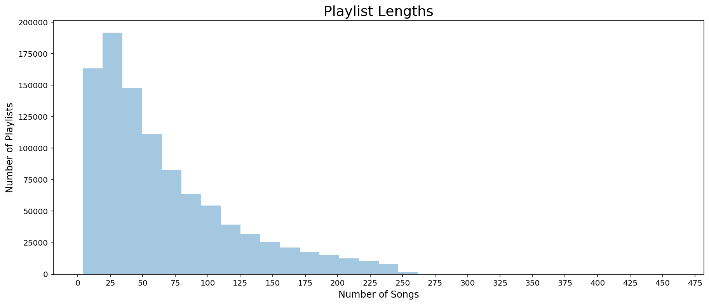

There are some outliers with very long lengths, but the average playlist is 50 songs long and the most common length is 20.

#### Artists
In the playlists, 296k unique artists exist:

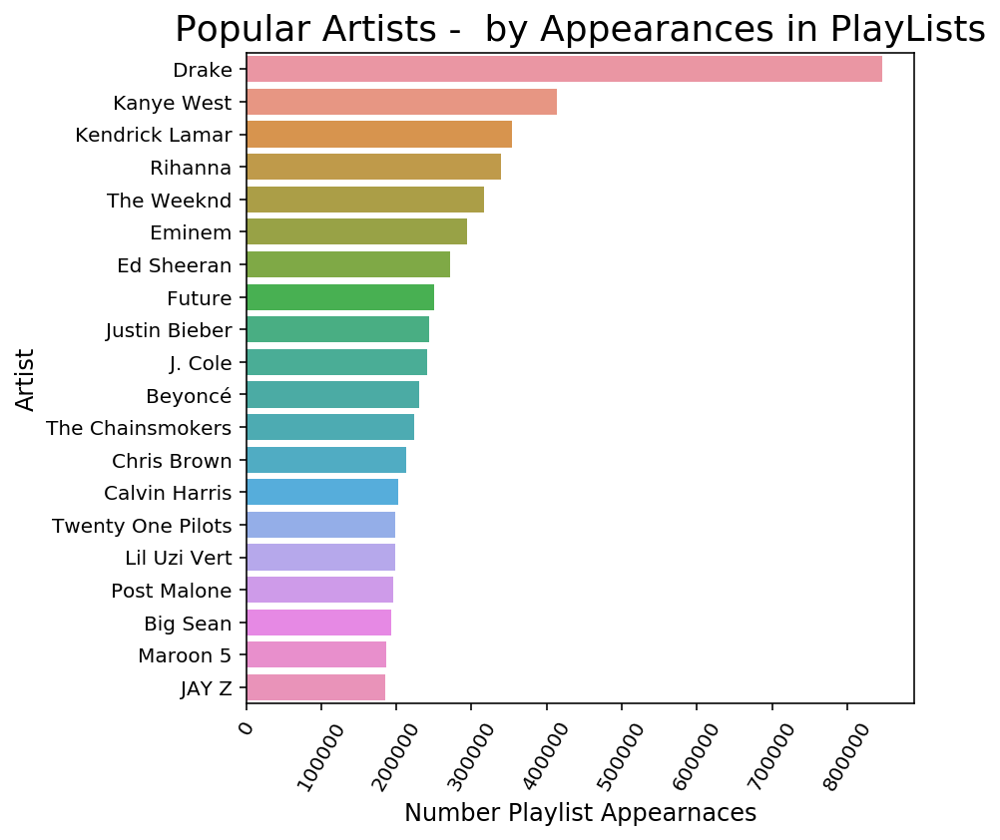

By examining the number of appearances in playlists, we are able to determine the popularity of Artists based on our dataset. Spotify also supplies a field called ‘artist popularity’; however, we found that a majority of Artists in our dataset had a popularity of 0, so we will not rely on the Spotify popularity data.

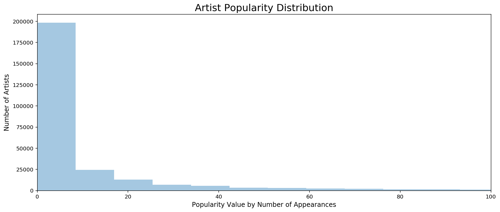

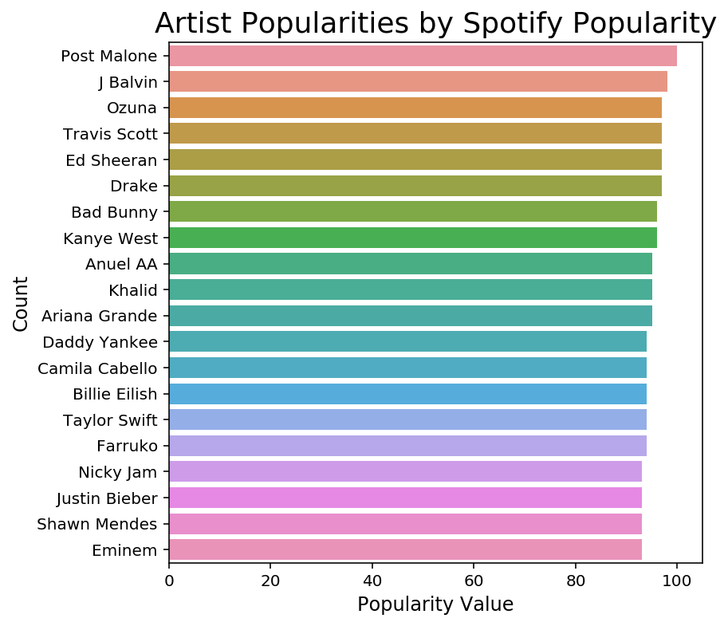

Spotify supplies genres by artist. After extracting this data, we determined that over 60% of artists had no genre assigned by Spotify, so we will not rely on this data.

#### Tracks
2.2M unique tracks can be found in the playlists

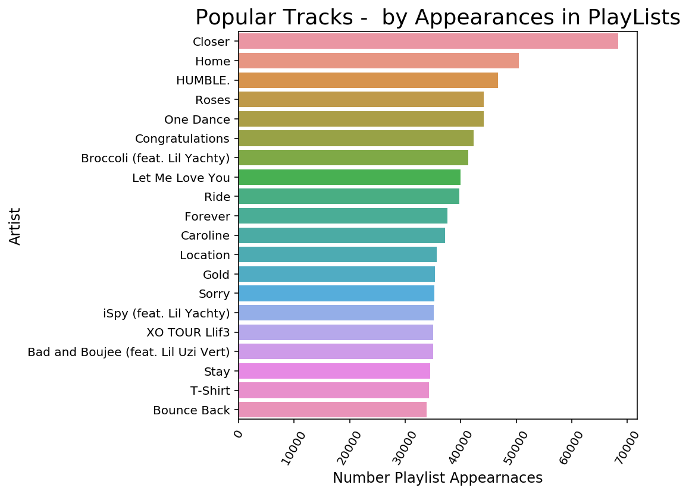

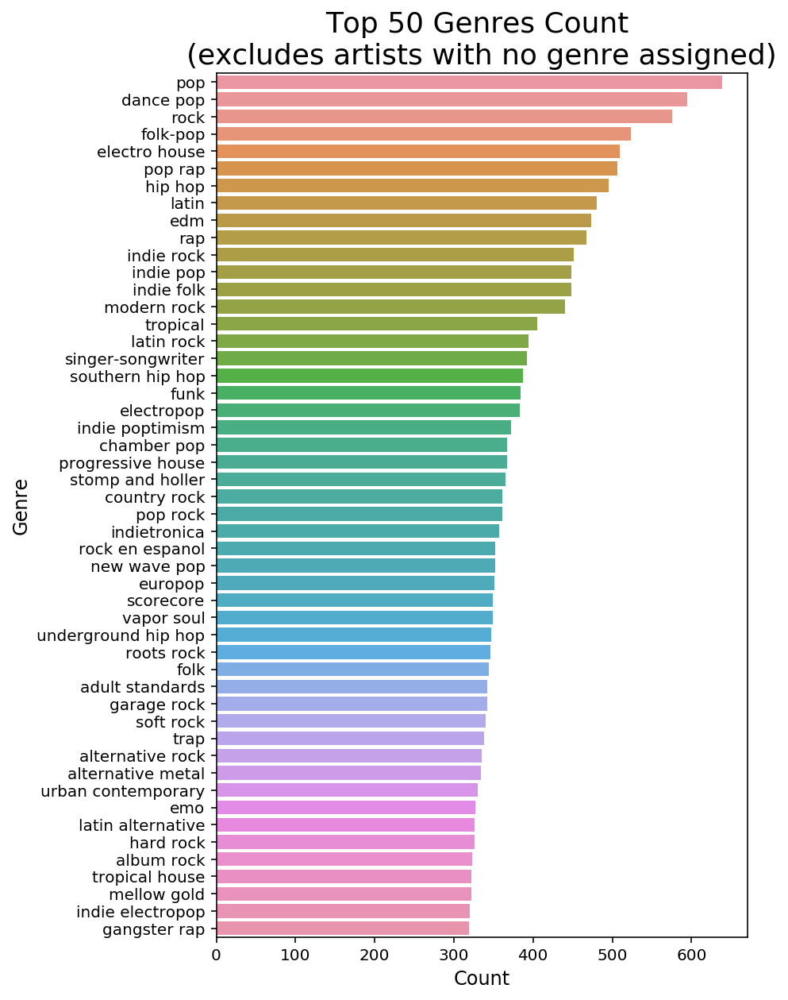

After querying data from Spotify, various additional useful fields are available for each track. Values are assigned to a significant portion of the population making these features potentially useful for building recommendation lists. Distributions of these features are shown below.

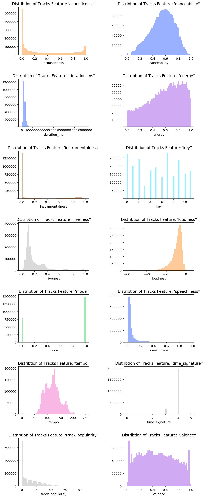

## Modeling

### Spotify Recommender Models 
[(index)](#table-of-contents)
Two strategies are explored for playlist creation, Embeddings(Word2Vec) and KNN.  The Embedding approach explores both collaborative and content-based recommendations while KNN focused on providing collaborative recommendations.

The content-based approach will recommend new songs based on the song characteristics of a user's songs.  Collaborative-based recommendations will find new songs based on playlists from other users.

### Our Models
#### 1 - Word2Vec 
[(index)](#table-of-contents)
Word2Vec is a libaray that supports the creation and use of vectorized words to predict other words. It does this by ingesting a series of documents, parsing out the words, vectorizing the words and then using the vector representations to predict other words. The vectors are built in such a way that each word has a unique vector that is based on its usage in the documents. The result is a vector space filled with words where related words have vectors that are similar. This vector space is referred to an an embedding. This embedding is used in two common word prediction tasks: Skip-Gram and Continuous Bag of Words but can also be used by itself as described below.

##### a - Embeddings

The vectorized space of words is referred to as an embedding. This embedding is generally used to train a Skip-Gram or a Bag-of-Words model; however, the embedding without the models is still quite useful by itself. It represents a vectorized vocabulary of words where vectorized words can be added or subtracted from one another to find the sum or difference of their meanings. Synonyms of words are other vectors with that are nearby in the embedded space. We will use this embedding to create a playlist based on songs that share a similar vector space as a seed song.

This is an unsupervised process that does not require any model training.  Since the embedding is based on a song's relativity to playlists, this is considered a collaborative-based approach.

To make a playlist, we simply convert Songs to Vectors and then find new songs by finding other songs with similar vectors. This is achieved using various approaches described below. 

##### b - Bag-of-Words
The bag-of-words model asks for a series of words and will return the missing word, or song in our case.  Bag-of-Words is a trained model based on the embedded space and is a supervised model and like skip-gram, it is collaborative-based.
##### c - Bag-of-Words
The bag-of-words model asks for a series of words and will return the missing word, or song in our case.  Bag-of-Words is a trained model based on the embedded space and is a supervised model and like skip-gram, it is collaborative-based.

##### c - Skip-Gram
The Skip-Gram model asks for a single word and then predicts words surrounding the word.  The Skip-Gram model is trained based on the embedding of songs so this is considered a supervised model and since it is using an embedding based on playlists from other users, it is collaborative-based.

##### d - Accoustic Vector Embeddings
Instead of using Word2Vec to create an embedded space of song vectors, this approach create 'custom' vectors for each song based on the accoustic characteristics found in Spotify.  The strategy allows songs with similar accoustic characteristics to be selected based on a user's seed song.  After these vectors are built, they are loaded into the Word2Vec libaray in order to exploit Word2Vec methods making playlist creation easier.

In order to create this vector space, additional steps are necessary to noramlize the data.  Word2Vec handles this automatically when building the space, but must be done manually in this case. 

#### 2 - kNN Collaborative Filtering 
[(index)](#table-of-contents)
Collaborative filtering relies on similarities between user behavior to make predictions. In recommendation systems, a matrix is often encoded to represent user behavior. For this model, the matrix represents playlists (in rows) vs. songs that are present in a given playlist (in columns), where a 1 represents a song being present. Given the large volume of songs, this matrix is very sparse.

This approach builds this sparse matrix using SKLearn's CountVectorizer and then uses cosine distance to make predictions using a k-nearest neighbors model. Recommendations are drawn from similar playlists while avoiding duplication with the input set. In short:

1. Build a sparse matrix for playlists X tracks
2. Fit a kNN model to this data using cosine distance
3. Find nearest playlists using this model given a list of songs
4. Select songs from nearest neighbor lists as recommendations

Two strategies are explored for selecting songs from the nearest neighbors. The first approach simply grabs songs from the closest neighbor(s) in order of proximity. The second approach counts the frequencies of song appearances among the selected neighbors, and recommends the most frequent songs in order.

### Model Scoring and Comparisons
#### R-Precision 
[(index)](#table-of-contents)
R-precision is the number of retrieved relevant tracks divided by the number of known relevant tracks (i.e., the number of withheld tracks):

$R-precision = \frac{|G \bigcap R_{1:|G|}|}{|G|}$
 

The metric is averaged across all playlists in the challenge set. This metric rewards total number of retrieved relevant tracks (regardless of order).

#### NDGC - Normalized discounted cumulative gain
[(index)](#table-of-contents)
Discounted cumulative gain (DCG) measures the ranking quality of the recommended tracks, increasing when relevant tracks are placed higher in the list. Normalized DCG (NDCG) is determined by calculating the DCG and dividing it by the ideal DCG in which the recommended tracks are perfectly ranked:

$DCG = rel_1 + \sum^{|R|}_{i=2}\frac{rel_i}{log_2(i+1)}$ 
 

The ideal DCG or IDCG is, on our case, equal to:

$IDCG = 1 + \sum^{|G|}_{i=2}\frac{1}{log_2(i+1)}$
 

If the size of the set intersection of G and R, is empty, then the DCG is equal to 0. The final NDCG metric is calculated as:

$NDCG=\frac{DCG}{IDCG}$
 

#### How our models performed 
[(index)](#table-of-contents)

##### 1 - Word2Vec
Scoring for the Word2Vec models included r-precision for both track and artist ocurrences as well as NDGC.  None of the models scored particularly well on any metric despite a strong subjective confirmation that the predictions were aligned with the seeded songs.  In order to provide an overall score, ranking are calculated for all 100 test playlists.  A histogram of the results is presented with an average score. 

a - Embeddings
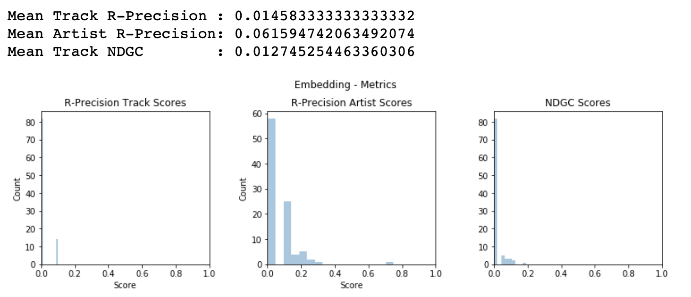
The results don't score well; however, the subjective analysis of the results were reasonable recommendations based on the seed track.

b - Bag-of-Words
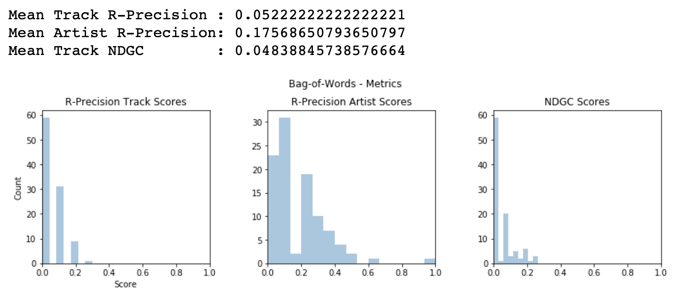
Although imporved metrics were expected due to the supervised nature of this model, the rankings for this approach are still low despite a very positive subjective assessment of the results.  Similar artists and songs are recommended, but the ranking compared to the test lists did not do well.

c - Skip-Gram
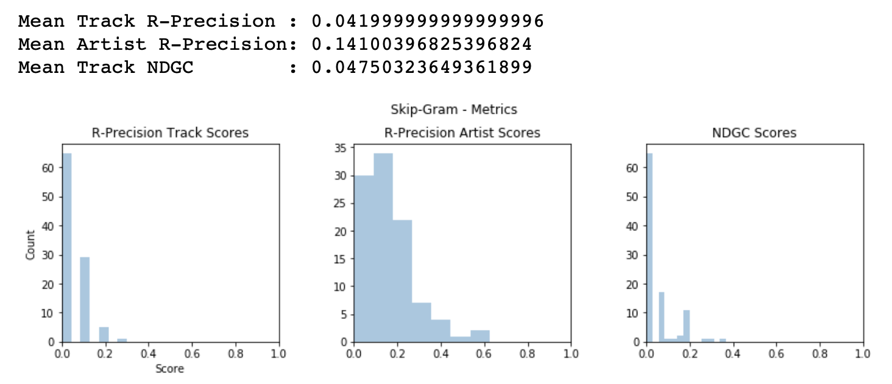
Just as with the previous 2 models, the scores for the Skip-Gram model are low but the model is producing song suggestions are are very much in line with the given set of tracks.

d - Accoustic Vectors
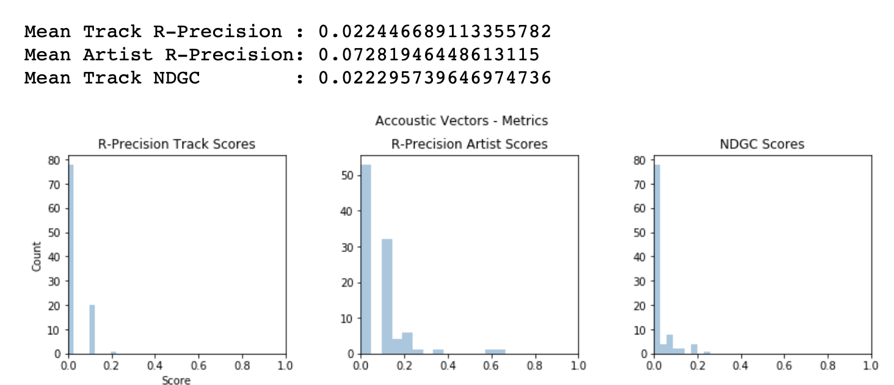
The results for this approach are terrible both objectively and subjectively.  What happened?

This approach takes independent songs and creates vectors from the songs features.  These vectors have nothing to do with the playlists and have no other relationship to other vectors other than their cosine similarity.  If the cosine similarity defines a song then why doesn't this work?  We are overestimating our assumption that the accoustic vectors will determine a song.  We also don't account for the fact that some songs are missing features.  When a value is 0, it will have a significant impact on the calculated cosine similarity.  Additionally, we can expect confounding factors that are not included in the vector space.  Music is an artist endeavor that is difficult to quantify.  If we had a wider range of genres available in the Spotify database avaiilable, we could expect an improvement since genre reflects some artistic quality.

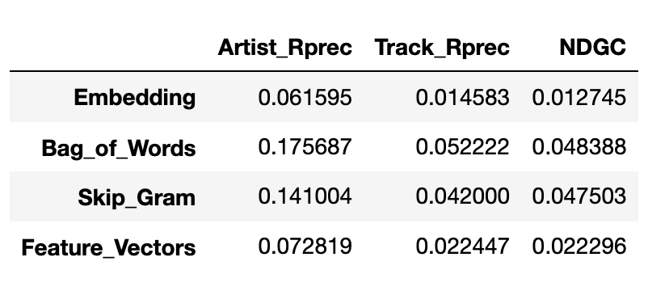
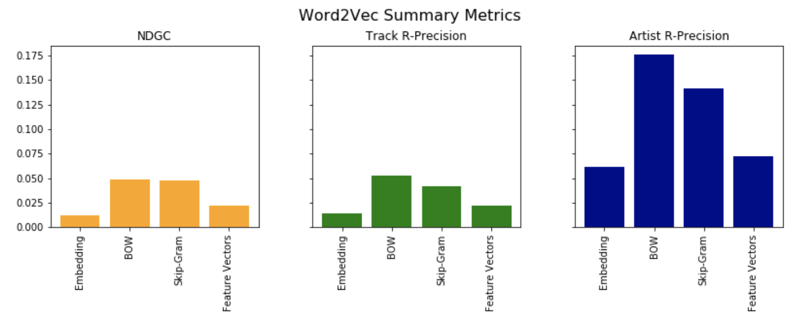

##### 2 - Collaborative Filtering & kNN
We considered 100 randomly selected playlists from the 10k playlist test set. Accuracies were generally similar regardless of sample size.
Per the original Spotify Recsys challenge, we made 500 recommendations per test playlist, and compared this to a subset of each test list
that was withheld from input. R-precision was calculated by checking for matches between recommendations and withheld tracks per playlist,
and then averaging these accuracies. Various values for k were considered, as well as 2 strategies for selecting tracks: a "naive" approach
where we selected songs strictly based on neighbor proximity, and an "improved" approach where songs were selected based on frequency among
neighbors.

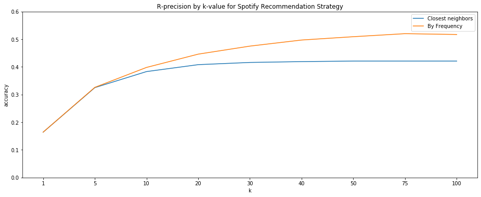

Accuracy increases with greater value of k up to a point. The closest neighbors approach flattens, presumably as it begins to have enough available playlists to consistently draw 500 recommendations--the method is deterministic in that it will always choose the same songs for the test set once it has enough neighbors to choose from (since it is purely based on playlist proximity). The frequent song approach quickly outperforms the closest neighbors approach, granting R-precision of >50%, and appears optimal around the k=75 range.

We see that reasonably large k tends to benefit song recommendation. Even for the 'naive' strategy we need a sufficient number of neighbors to pull enough recommendations, and we see even greater improvent by further analyzing song frequency. It is noteworthy that this implementation takes a fairly long time to run recommendations for large numbers of data sets. SKLearn's kNN model doesn't appear well-suited toward large matrices. That said, even though we used the entire training data set here, earlier testing suggested that we could achieve solid results by training with just a portion of the data. The song recommendation strategies here were also rather slow, but that could likely be improved.

### Literature Review 
[(index)](#table-of-contents)

## Conclusions and Improvements
[(index)](#table-of-contents)

Except for the "home-made" accoustic vectors, all the models presented produced reasonable results.  The kNN model produced the hightest objective scores while the Word2Vec models were significantly lower.  With the benefits the kNN provides with accuracy comes the downside in training and inference time.  Although not measured in a controlled experiment, training and inference times were notably faster using Word2Vec.  This makes sense since inference with Word2Vec is a lookup while kNN requires a review of each database element.  

The kNN model did a far better job of predicting playlists based on other existing playists.  The Word2Vec models produced subjectively solid results with poor scores.  This is likely due to the nature of Word2Vec looking for synonyms rather than replications.  The result will be playlists that look like similar playlsts, but don't match them.

Improvements for this effort would start with improved database access speeds.  The large volume of data placed a burden on the rudimentary SQLite database that was used.  This slowed training times and limited the ability to experiment on the full dataset.

Additional improvements would include creating additional dimensions of data for all songs, most notably 'genre'.  Genre is a characteristic that includes some artist relevance to songs and is a frequent criteria for building playlists.  The incomplete data from Spotify for the characteristic limited the ability to use this potentially useful characteristic.  Using the LastFM database or even trying to infer genres would be possible approaches to solving this problem.

